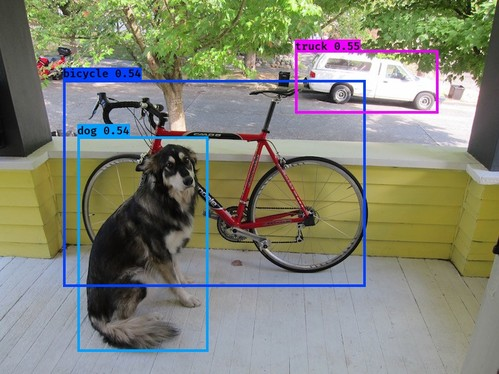

# Real-time Object Detection using YOLO

Real-time Object Detection using YOLO algorithm. You only look once (YOLO) is a state-of-the-art, real-time object detection system that is extremely fast and accurate. You can read more about it [here](https://pjreddie.com/darknet/yolo/).

<div align="center">
   
</div>

## Getting Started

In order to make detections, you will need to install the required python packages. I recommend using `virtualenv` for this one if you're into that stuff:

```bash
pip install -r requirements.txt
```

This project uses [YAD2K](https://github.com/allanzelener/YAD2K) helper to build the Darknet19 model using YOLO pre-trained weights and configuration which you will need to download in order to make detections on images:

```bash
git clone https://github.com/allanzelener/YAD2K.git
cd YAD2K
wget http://pjreddie.com/media/files/yolo.weights
wget https://raw.githubusercontent.com/pjreddie/darknet/master/cfg/yolo.cfg
```

Now, you can go ahead and build the Darknet19 model using:

```bash
python yad2k.py  yolo.cfg yolo.weights yolo_model.h5 --fully_convolutional
```

Once you have the pre-trained model `yolo_model.h5`, move it over to `model_data/` dir in your project and start detecting all kinds of stuff in **real-time**:

```bash
python main.py --realtime
```

You can also run the detection on images, all you need to do is provide the path of the image (results in `images/out/`):

```bash
python main.py --image-path images/test/cars.jpg
```

And you're done.

## Build With

* Python
* Keras
* TensorFlow
* Pillow
* Scipy

## References

* [You Only Look Once: Unified, Real-Time Object Detection](https://arxiv.org/abs/1506.02640)
* [YOLO9000: Better, Faster, Stronger](https://arxiv.org/abs/1612.08242)

## Credits

* [YOLO: Real-Time Object Detection](https://pjreddie.com/darknet/yolo/)
* [YAD2K](https://github.com/allanzelener/YAD2K)